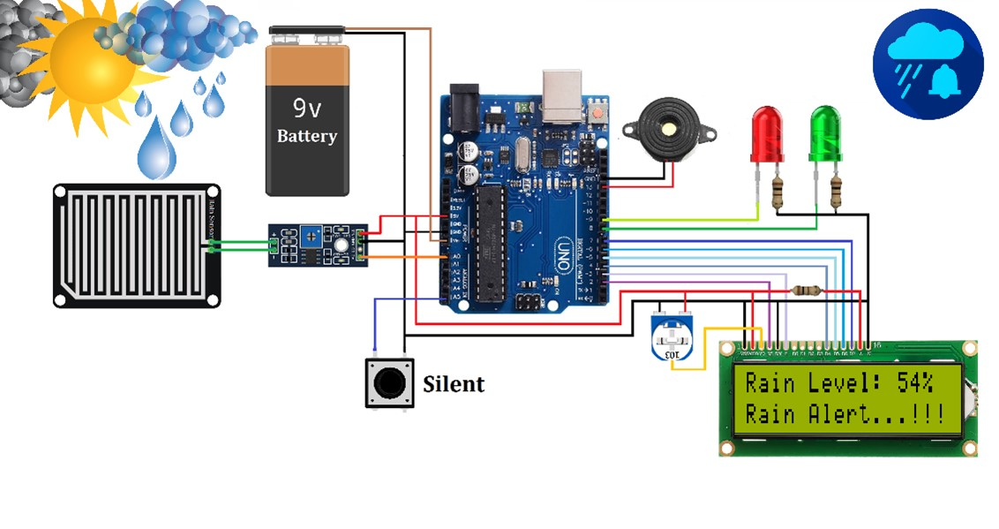
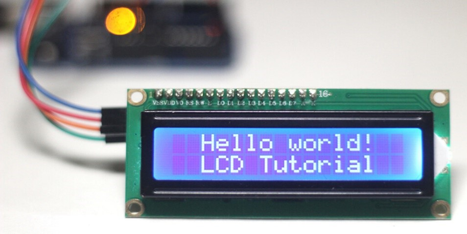

# Rain-Meter

# Rain Sensor Alarm system with Arduino

## Description
This project demonstrates the usage of a rain sensor and buzzer with Arduino.
 

    
  </a>
  

   
  

    
  </a>
  

   
   

    
  </a>
  

   
  
## Hardware Components
- Arduino board
- Rain sensor
- 16*2 LCD Display
- Buzzer

## Usage Instructions

* Download [Arduino](https://support.arduino.cc/hc/en-us/articles/360019833020-Download-and-install-Arduino-IDE)
* Make connections on the Arduino board. This [YouTube videos](https://www.youtube.com/results?search_query=arduino+rain+sensor) can help. 
* Add [the code](https://github.com/Darkwarrior247/Rain-Meter/blob/main/Rain-meter/Rain-meter.ino)

## Pin Configurations

- Rain Sensor Pin: A0
- LCD Dispaly Pin: D8
- Buzzer Pin: 7

If you need to change pin configurations, locate the corresponding section in the Arduino code and update the pin numbers accordingly.

## License
This project is licensed under the [Your License Name] - see the [LICENSE](LICENSE) file for details.
 

<a href="#readme-top">Back to the Top ↑ </a>

